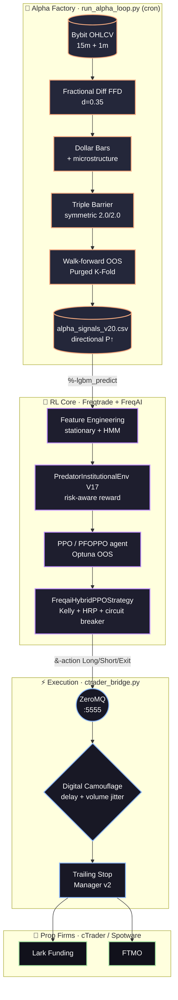
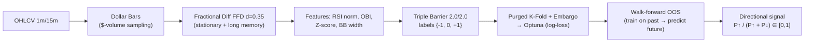

<div align="center">

# 🦅 ApexQuant

**Institutional algorithmic trading architecture — LightGBM Alpha × Reinforcement Learning (PPO) execution**


-orange)


*Inspired by "Advances in Financial Machine Learning" (Marcos López de Prado)*

</div>

---

## 📖 Table of contents
1. [Philosophy](#-philosophy)
2. [Architecture](#-architecture)
3. [The 4 engines](#-the-4-engines)
4. [The Alpha pipeline in detail](#-the-alpha-pipeline-in-detail)
5. [The Reinforcement Learning core](#-the-reinforcement-learning-core)
6. [Prop Firm safeguards](#-prop-firm-safeguards)
7. [Repository layout](#-repository-layout)
8. [Installation](#-installation)
9. [Usage](#-usage)
10. [Configuration](#-configuration)
11. [Status & limitations](#-status--limitations-honest)
12. [Security](#-security)
13. [Roadmap](#-roadmap)

---

## 🎯 Philosophy

ApexQuant is built on a **decoupling** principle drawn from López de Prado: **mathematically separate Alpha generation (the *what*) from the execution policy (the *when / how much*).**

- **Left brain — Alpha (LightGBM)**: produces a *pure*, out-of-sample directional signal on stationary features. It answers "will the market go up or down?".
- **Right brain — Execution (PPO / Reinforcement Learning)**: decides *when to enter/exit*, *how much to risk*, and *when to stand aside*, under Prop Firm drawdown constraints. It answers "how do I trade this signal without getting eliminated?".

> Raw prices are **never** fed to the agent. Only stationary features (fractional differentiation, z-scores, microstructure) and the Alpha signal enter its observation space.

---

## 🏛️ Architecture



**CWD decoupling**: the *bridge* and *dashboard* launch from the repo root; *freqtrade* from `ft_userdata/`. See [`docs/ARCHITECTURE_TARGET.md`](docs/ARCHITECTURE_TARGET.md) for the planned structural refactor.

---

## ⚙️ The 4 engines

| Engine | File | Role |
|---|---|---|
| 🔬 **Alpha Factory** | `ft_userdata/user_data/run_alpha_loop.py` → `LGBM_Alpha_Pipeline_V20.py` | Cron: downloads data, computes stationary features, labels (Triple Barrier), generates the **walk-forward OOS** directional signal into `alpha_signals_v20.csv`. |
| 🧠 **RL Core** | `strategies/FreqaiHybridPPOStrategy.py` + `freqaimodels/CustomPPOModel.py` + `environments/PredatorInstitutionalEnv.py` | Trains a **PPO** agent that learns to execute the Alpha under a drawdown constraint, then emits orders over ZMQ. |
| ⚡ **Execution Bridge** | `infrastructure/execution/ctrader_bridge.py` | Listens on ZMQ `:5555`, applies anti-copy-trading camouflage, dispatches to **all Prop Firm accounts** simultaneously via cTrader Open API. |
| 📊 **Dashboard** | `infrastructure/monitoring/apexquant_dashboard.py` | Streamlit cockpit: equity, drawdown, HMM regime, PPO convergence metrics (via TensorBoard), network latencies. |

---

## 🔬 The Alpha pipeline in detail



**Anti-overfitting rigor:**
- **Fractional differentiation (FFD)** — makes prices stationary while preserving long memory (causal).
- **Dollar Bars** — sampling by monetary volume (statistically more stable than clock time), aligned without look-ahead (`merge_asof backward`).
- **Symmetric Triple Barrier 2.0/2.0** — balanced up/down labels (avoids PPO exploration starvation).
- **Purged K-Fold + Embargo** — eliminates data leakage from overlapping labels.
- **Walk-forward OOS signal** — every historical candle is predicted by a model trained **only on its past** → *no in-sample leakage*.
- **Optimization on `log-loss`** (never accuracy) → penalizes overconfidence.

---

## 🧠 The Reinforcement Learning core

**Environment — `PredatorInstitutionalEnv` (V17)**
*Risk-aware* reward function:

```
reward = realized_profit  −  (Downside Deviation × 15)  −  exponential_Drawdown_penalty
```

- **Downside Deviation** (semi-variance): penalizes *downside* volatility only.
- **Exponential drawdown penalty** beyond **3%** (FTMO safety margin), capped.
- **Action Masking**: blocks entries when the **HMM regime** is chaotic.
- `reset()` resets peak equity per episode (no phantom penalty).

**Model — `CustomPPOModel` (PFOPPO)**
- PPO (Stable-Baselines3) overridden with feature-extractor regularization.
- **Optuna** tuning evaluated **out-of-sample** (`eval_env`) on the explained variance of discounted returns.

**Strategy — `FreqaiHybridPPOStrategy`**
- Consumes `&-action` (PPO decision) + `%-lgbm_predict` (Alpha).
- **Half-Kelly sizing**, bounded (stands aside if edge is negative).
- **HRP allocation** hot-reloaded from `hrp_allocations.csv`.
- **Circuit-breaker** stop-loss + `MaxDrawdown` protection at 4%.
- x3 isolated leverage, order emission over **ZeroMQ** to the bridge.

---

## 🛡️ Prop Firm safeguards

| Safeguard | Mechanism |
|---|---|
| **Daily drawdown** | Exponential RL penalty >3% + Freqtrade `MaxDrawdown` protection at 4% (margin below the 5% limit) |
| **Circuit-breaker** | Permanent emergency stop-loss (`self.stoploss`), never disabled |
| **Anti-martingale** | Half-Kelly sizing, stand aside if edge ≤ 0 |
| **Anti-copy-trading** | Random time delay (1–5s) + volume jittering (±2%) per account |
| **Toxic regime** | Entry masking if HMM = chaotic |

---

## 📂 Repository layout

```text
ApexQuant/
├── start_apexquant_live.sh          # Launches bridge + freqtrade + dashboard
├── start_paper_trading.sh
├── ctrader_tokens.json              # ⚠️ creds (gitignored) — provide locally
├── docs/
│   ├── DOCU.MD                       # Theoretical foundations
│   ├── Technical_blueprint.txt       # Feature-engineering blueprint
│   └── ARCHITECTURE_TARGET.md        # Planned structural refactor
├── ft_userdata/
│   ├── hrp_allocations.csv · hrp_allocator.py
│   └── user_data/
│       ├── LGBM_Alpha_Pipeline_V20.py   # Alpha pipeline (walk-forward OOS)
│       ├── run_alpha_loop.py            # Alpha Factory cron
│       ├── config_live.json · config_freqai_rl-v10.json · config_backtest_v20.json
│       ├── strategies/FreqaiHybridPPOStrategy.py
│       ├── freqaimodels/CustomPPOModel.py
│       └── environments/PredatorInstitutionalEnv.py
└── infrastructure/
    ├── execution/    # ctrader_bridge, trailing_stop_manager_v2, ctrader_auth, ...
    ├── monitoring/   # apexquant_dashboard, read_tb
    └── portfolio/    # hrp_allocation, hrp_updater, propfirm_monte_carlo
```

---

## 🚀 Installation

```bash
# 1. Clone
git clone https://github.com/Kevzi/ApexQuant.git && cd ApexQuant

# 2. Freqtrade + FreqAI environment (Python 3.10+)
python -m venv .env && source .env/bin/activate
pip install freqtrade[freqai,freqai_rl]        # + lightgbm, optuna, hmmlearn, pyzmq, ctrader-open-api

# 3. Provide cTrader credentials
cp ctrader_tokens.example.json ctrader_tokens.json   # then fill in the Spotware IDs/tokens

# 4. Download market data
cd ft_userdata
freqtrade download-data --config user_data/config_live.json --timerange 20220101- -t 1m 15m 1h 4h
```

---

## 🖥️ Usage

**1 — Generate the Alpha signal (OOS)**
```bash
cd ft_userdata
python user_data/LGBM_Alpha_Pipeline_V20.py \
  --pairs "BTC/USDT:USDT,ETH/USDT:USDT" \
  --output user_data/alpha_signals_v20.csv
```

**2 — Backtest**
```bash
cd ft_userdata
freqtrade backtesting \
  --strategy FreqaiHybridPPOStrategy \
  --config user_data/config_live.json \
  --config user_data/config_freqai_rl-v10.json \
  --freqaimodel CustomPPOModel \
  --timerange 20260401-20260701
```

**3 — Live / Paper trading (full stack)**
```bash
./start_apexquant_live.sh          # bridge + freqtrade trade + dashboard (:8501)
```

---

## 🔧 Configuration

| Key | File | Value |
|---|---|---|
| Exchange / market | `config_live.json` | Bybit futures, USDT, isolated |
| Timeframe | `config_freqai_rl-v10.json` | 15m (corr: 1h, 4h) |
| Active pairs | `config_freqai_rl-v10.json` | BTC, ETH (extensible) |
| Leverage | strategy | x3 |
| `train_period_days` / `backtest_period_days` | `config_freqai_rl-v10.json` | 30 / 7 |
| PPO `total_timesteps` | `config_freqai_rl-v10.json` | 350,000 |
| `optuna_tuning` | `config_freqai_rl-v10.json` | `false` by default |

---

## 📊 Status & limitations (honest)

> **⚠️ This system is in a validation phase (dry-run). The edge is not yet proven.**

- ✅ Live infrastructure operational (multi-account bridge, dashboard, Alpha cron).
- ✅ **Leak-free** Alpha pipeline (walk-forward OOS) and corrected RL environment.
- ⏳ **Performance not validated**: to be filled with multi-period backtests + Monte Carlo before any real capital.
- ⏳ **Structural refactor** pending (see `docs/ARCHITECTURE_TARGET.md`).
- ℹ️ The *Dissimilarity Index* anomaly filtering described in the blueprint is **disabled by FreqAI in RL mode**; the real protection comes from HMM masking + drawdown penalty + `MaxDrawdown`.

| Metric (to validate) | BTC | ETH |
|---|---|---|
| Net profit % | _TBD_ | _TBD_ |
| # trades | _TBD_ | _TBD_ |
| Max drawdown % | _TBD_ | _TBD_ |
| Sharpe / Sortino | _TBD_ | _TBD_ |

---

## 🔐 Security

- **`ctrader_tokens.json`** (cTrader tokens) is **gitignored** — never commit it.
- Store **no** credentials/passwords in cleartext in the repo (prefer environment variables / a secrets manager).
- Tracked config files ship with **placeholders only** (`VOTRE_CLE_BYBIT`, etc.) — never replace them with real keys in a committed file. This repo is **public**, so keep every real credential out of version control.

---

## 🗺️ Roadmap

- [ ] Multi-period backtests + Walk-Forward Efficiency ≥ 0.7 validation + Monte Carlo.
- [ ] Enable/evaluate the corrected PPO Optuna tuning (OOS).
- [ ] Structural refactor: single `user_data/`, config-driven paths.
- [ ] Gradual pair expansion (SOL, BNB, …) once the edge is confirmed on BTC/ETH.

---

<div align="center">
<sub>A model's profitability comes not from its directional accuracy, but from the mathematical robustness of how it manages its failures.</sub>
</div>
