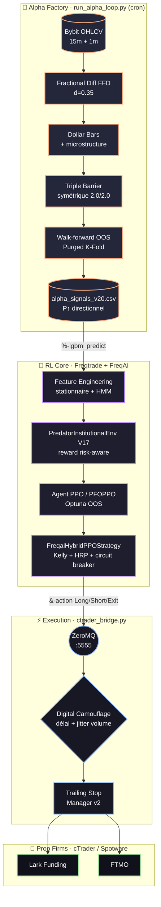
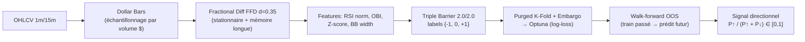

<div align="center">

# 🦅 ApexQuant

**Architecture de trading algorithmique institutionnelle — Alpha LightGBM × Exécution par Reinforcement Learning (PPO)**


-orange)


*Inspiré de « Advances in Financial Machine Learning » (Marcos López de Prado)*

</div>

---

## 📖 Table des matières
1. [Philosophie](#-philosophie)
2. [Architecture](#-architecture)
3. [Les 4 moteurs](#-les-4-moteurs)
4. [Le pipeline Alpha en détail](#-le-pipeline-alpha-en-détail)
5. [Le cœur Reinforcement Learning](#-le-cœur-reinforcement-learning)
6. [Garde-fous Prop Firm](#-garde-fous-prop-firm)
7. [Arborescence](#-arborescence)
8. [Installation](#-installation)
9. [Utilisation](#-utilisation)
10. [Configuration](#-configuration)
11. [Statut & limites](#-statut--limites-honnête)
12. [Sécurité](#-sécurité)
13. [Roadmap](#-roadmap)

---

## 🎯 Philosophie

ApexQuant repose sur un principe de **découplage** issu de López de Prado : **séparer mathématiquement la génération d'Alpha (le *quoi*) de la politique d'exécution (le *quand / combien*).**

- **Cerveau gauche — Alpha (LightGBM)** : produit un signal directionnel *pur*, hors-échantillon, sur des features stationnaires. Il répond à « le marché va-t-il monter ou descendre ? ».
- **Cerveau droit — Exécution (PPO / Reinforcement Learning)** : décide *quand entrer/sortir*, *combien risquer*, et *quand s'abstenir*, sous contraintes de drawdown Prop Firm. Il répond à « comment trader ce signal sans se faire éliminer ? ».

> Les prix bruts ne sont **jamais** donnés à l'agent. Seules des features stationnaires (différenciation fractionnaire, z-scores, microstructure) et le signal Alpha entrent dans son espace d'observation.

---

## 🏛️ Architecture



**Découplage CWD** : le *bridge* et le *dashboard* se lancent depuis la racine du repo ; *freqtrade* depuis `ft_userdata/`. Voir [`docs/ARCHITECTURE_TARGET.md`](docs/ARCHITECTURE_TARGET.md) pour le refactor structurel prévu.

---

## ⚙️ Les 4 moteurs

| Moteur | Fichier | Rôle |
|---|---|---|
| 🔬 **Alpha Factory** | `ft_userdata/user_data/run_alpha_loop.py` → `LGBM_Alpha_Pipeline_V20.py` | Cron : télécharge les données, calcule les features stationnaires, étiquette (Triple Barrier), génère le signal directionnel **walk-forward OOS** dans `alpha_signals_v20.csv`. |
| 🧠 **RL Core** | `strategies/FreqaiHybridPPOStrategy.py` + `freqaimodels/CustomPPOModel.py` + `environments/PredatorInstitutionalEnv.py` | Entraîne un agent **PPO** qui apprend à exécuter l'Alpha sous contrainte de drawdown, puis émet les ordres via ZMQ. |
| ⚡ **Execution Bridge** | `infrastructure/execution/ctrader_bridge.py` | Écoute ZMQ `:5555`, applique le camouflage anti-copy-trading, dispatche vers **tous les comptes Prop Firm** simultanément via cTrader Open API. |
| 📊 **Dashboard** | `infrastructure/monitoring/apexquant_dashboard.py` | Cockpit Streamlit : équité, drawdown, régime HMM, métriques de convergence PPO (via TensorBoard), latences réseau. |

---

## 🔬 Le pipeline Alpha en détail



**Rigueur anti-overfitting :**
- **Différenciation fractionnaire (FFD)** — rend les prix stationnaires en préservant la mémoire longue (causal).
- **Dollar Bars** — échantillonnage par volume monétaire (statistiquement plus stable que le temps), aligné sans look-ahead (`merge_asof backward`).
- **Triple Barrier symétrique 2.0/2.0** — labels équilibrés hausse/baisse (évite la famine d'exploration du PPO).
- **Purged K-Fold + Embargo** — élimine les fuites de données dues au chevauchement des labels.
- **Signal walk-forward OOS** — chaque bougie historique est prédite par un modèle entraîné **uniquement sur son passé** → *aucune fuite in-sample*.
- **Optimisation sur `log-loss`** (jamais l'accuracy) → pénalise la surconfiance.

---

## 🧠 Le cœur Reinforcement Learning

**Environnement — `PredatorInstitutionalEnv` (V17)**
Fonction de récompense *risk-aware* :

```
reward = profit_réalisé  −  (Downside Deviation × 15)  −  Pénalité_Drawdown_exponentielle
```

- **Downside Deviation** (semi-variance) : pénalise la volatilité *baissière* uniquement.
- **Pénalité de drawdown exponentielle** au-delà de **3 %** (marge de sécurité FTMO), plafonnée.
- **Action Masking** : bloque les entrées quand le **régime HMM** est chaotique.
- `reset()` réinitialise l'équité pic par épisode (pas de pénalité fantôme).

**Modèle — `CustomPPOModel` (PFOPPO)**
- PPO (Stable-Baselines3) surchargé avec régularisation de l'extracteur de features.
- Tuning **Optuna** évalué **out-of-sample** (`eval_env`) sur l'explained variance des rendements actualisés.

**Stratégie — `FreqaiHybridPPOStrategy`**
- Consomme `&-action` (décision PPO) + `%-lgbm_predict` (Alpha).
- **Sizing Half-Kelly** borné (abstention si edge négatif).
- **Allocation HRP** rechargée à chaud depuis `hrp_allocations.csv`.
- **Circuit-breaker** stop-loss + protection `MaxDrawdown` à 4 %.
- Levier x3 isolé, émission des ordres par **ZeroMQ** vers le bridge.

---

## 🛡️ Garde-fous Prop Firm

| Garde-fou | Mécanisme |
|---|---|
| **Drawdown quotidien** | Pénalité RL exponentielle >3 % + protection Freqtrade `MaxDrawdown` 4 % (marge sous la limite 5 %) |
| **Circuit-breaker** | Stop-loss d'urgence permanent (`self.stoploss`), jamais désactivé |
| **Anti-martingale** | Sizing Half-Kelly, abstention si edge ≤ 0 |
| **Anti-copy-trading** | Délai temporel aléatoire (1–5 s) + jittering de volume (±2 %) par compte |
| **Régime toxique** | Masking des entrées si HMM = chaotique |

---

## 📂 Arborescence

```text
ApexQuant/
├── start_apexquant_live.sh          # Lance bridge + freqtrade + dashboard
├── start_paper_trading.sh
├── ctrader_tokens.json              # ⚠️ creds (gitignore) — à fournir localement
├── docs/
│   ├── DOCU.MD                       # Fondations théoriques
│   ├── Technical_blueprint.txt       # Blueprint feature engineering
│   └── ARCHITECTURE_TARGET.md        # Refactor structurel prévu
├── ft_userdata/
│   ├── hrp_allocations.csv · hrp_allocator.py
│   └── user_data/
│       ├── LGBM_Alpha_Pipeline_V20.py   # Pipeline Alpha (walk-forward OOS)
│       ├── run_alpha_loop.py            # Cron Alpha Factory
│       ├── config_live.json · config_freqai_rl-v10.json · config_backtest_v20.json
│       ├── strategies/FreqaiHybridPPOStrategy.py
│       ├── freqaimodels/CustomPPOModel.py
│       └── environments/PredatorInstitutionalEnv.py
└── infrastructure/
    ├── execution/    # ctrader_bridge, trailing_stop_manager_v2, ctrader_auth, ...
    ├── monitoring/   # apexquant_dashboard, read_tb
    └── portfolio/    # hrp_allocation, hrp_updater, propfirm_monte_carlo
```

---

## 🚀 Installation

```bash
# 1. Cloner
git clone https://github.com/Kevzi/ApexQuant.git && cd ApexQuant

# 2. Environnement Freqtrade + FreqAI (Python 3.10+)
python -m venv .env && source .env/bin/activate
pip install freqtrade[freqai,freqai_rl]        # + lightgbm, optuna, hmmlearn, pyzmq, ctrader-open-api

# 3. Fournir les credentials cTrader
cp ctrader_tokens.example.json ctrader_tokens.json   # puis renseigner les IDs/tokens Spotware

# 4. Télécharger les données de marché
cd ft_userdata
freqtrade download-data --config user_data/config_live.json --timerange 20220101- -t 1m 15m 1h 4h
```

---

## 🖥️ Utilisation

**1 — Générer le signal Alpha (OOS)**
```bash
cd ft_userdata
python user_data/LGBM_Alpha_Pipeline_V20.py \
  --pairs "BTC/USDT:USDT,ETH/USDT:USDT" \
  --output user_data/alpha_signals_v20.csv
```

**2 — Backtest**
```bash
cd ft_userdata
freqtrade backtesting \
  --strategy FreqaiHybridPPOStrategy \
  --config user_data/config_live.json \
  --config user_data/config_freqai_rl-v10.json \
  --freqaimodel CustomPPOModel \
  --timerange 20260401-20260701
```

**3 — Live / Paper trading (stack complet)**
```bash
./start_apexquant_live.sh          # bridge + freqtrade trade + dashboard (:8501)
```

---

## 🔧 Configuration

| Clé | Fichier | Valeur |
|---|---|---|
| Exchange / marché | `config_live.json` | Bybit futures, USDT, isolated |
| Timeframe | `config_freqai_rl-v10.json` | 15m (corr : 1h, 4h) |
| Paires actives | `config_freqai_rl-v10.json` | BTC, ETH (extensible) |
| Levier | stratégie | x3 |
| `train_period_days` / `backtest_period_days` | `config_freqai_rl-v10.json` | 30 / 7 |
| `total_timesteps` PPO | `config_freqai_rl-v10.json` | 350 000 |
| `optuna_tuning` | `config_freqai_rl-v10.json` | `false` par défaut |

---

## 📊 Statut & limites (honnête)

> **⚠️ Ce système est en phase de validation (dry-run). L'edge n'est pas encore prouvé.**

- ✅ Infrastructure live opérationnelle (bridge multi-comptes, dashboard, cron Alpha).
- ✅ Pipeline Alpha **sans fuite** (walk-forward OOS) et environnement RL corrigé.
- ⏳ **Performance non validée** : à remplir avec des backtests multi-périodes + Monte-Carlo avant tout capital réel.
- ⏳ **Refactor structurel** en attente (voir `docs/ARCHITECTURE_TARGET.md`).
- ℹ️ Le filtrage d'anomalies par *Dissimilarity Index* décrit dans le blueprint est **désactivé par FreqAI en mode RL** ; la protection réelle vient du masking HMM + pénalité de drawdown + `MaxDrawdown`.

| Métrique (à valider) | BTC | ETH |
|---|---|---|
| Profit net % | _à remplir_ | _à remplir_ |
| Nb trades | _à remplir_ | _à remplir_ |
| Max drawdown % | _à remplir_ | _à remplir_ |
| Sharpe / Sortino | _à remplir_ | _à remplir_ |

---

## 🔐 Sécurité

- **`ctrader_tokens.json`** (tokens cTrader) est **gitignore** — ne jamais le committer.
- Ne stockez **aucun** identifiant/mot de passe en clair dans le repo (préférez variables d'environnement / gestionnaire de secrets).
- Ce repo est **privé** ; le maintenir privé tant que des configs de comptes réels y figurent.

---

## 🗺️ Roadmap

- [ ] Backtests multi-périodes + validation Walk-Forward Efficiency ≥ 0.7 + Monte-Carlo.
- [ ] Activer/évaluer le tuning Optuna PPO corrigé (OOS).
- [ ] Refactor structurel : `user_data/` unique, chemins pilotés par config.
- [ ] Extension progressive des paires (SOL, BNB, …) une fois l'edge confirmé sur BTC/ETH.

---

<div align="center">
<sub>La rentabilité d'un modèle ne vient pas de sa précision directionnelle, mais de la robustesse mathématique de la gestion de ses échecs.</sub>
</div>
